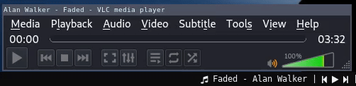
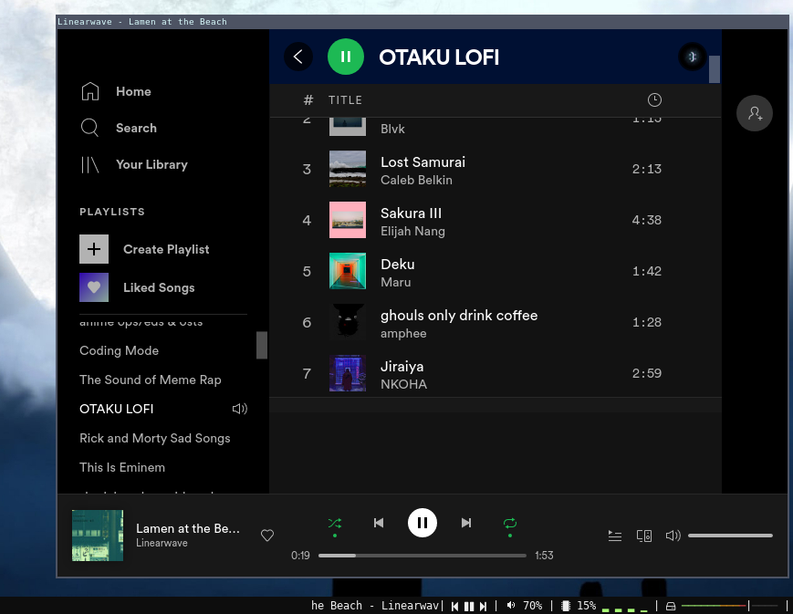

# polybar-now-playing
Script for polybar to display and control media(not only Spotify) using DBus

Python script to display and control current playing media. Includes a way to switch between players.
Scrolling text used for metadata(title, artist, album, etc.) and playback button based on [spotify-polybar](https://github.com/PrayagS/polybar-spotify) and [zscroll](https://github.com/noctuid/zscroll).

#### Demo:






### Dependencies

- [python3](https://www.python.org/downloads/): Required to run the script
- [playerctl](https://github.com/altdesktop/playerctl): Required to control players
- [dbus-python](https://pypi.org/project/dbus-python/): python module required to interact with [DBus](https://www.freedesktop.org/wiki/Software/dbus/) message bus system

### Setup & Configuration
- This script requires a monospace font to work as expected, so adding a monospace font to your polybar config is adviced. After adding the font, update the index in `polybar-now-playing` file where indicated.
Font indices are 1-based so be careful, refer [polybar:Fonts](https://github.com/polybar/polybar/wiki/Fonts#fonts).
- Format of playing track/media details by default is "title - artist". It can be changed by specifying respective field names in `metadata_fields` list. For more details/ field names, refer [mpris sepecification](https://www.freedesktop.org/wiki/Specifications/mpris-spec/metadata/).

```python3
# Config options

# (int) : Length of media info string. If length of string exceedes this value,
# the text will scroll. Default value is 20.
message_display_len = 20

# (int) : Font index of polybar. this value should be 1 more than the font
# value specified in polybar config.
font_index = <font index defined in polybar config> + 1


# (float) : Update speed of the text in seconds. Default value 0.3.
update_delay = 0.3

# (list) : list of chars containing previous, play, pause, next glyphs
# for media controls in respective order.
# example:
control_chars = ['','','','']

# (dict) : dict of char icons to display as prefix.
# If player name is available as key, then use the corressponding icon,
# else default.
# example:
display_player_prefix = {
    "spotify":  '',
    "firefox":  '',
    "default":  ''
}

# (list) : list of metadata fields based on mpris sepecification.
metadata_fields = ["xesam:title", "xesam:artist"]

# (char) : separator for metadata fields
metadata_separator = "-"
```

- After setting the options, add the following to your polybar config.

```ini
[module/now-playing]
type = custom/script
tail = true
;format-prefix = ""
format = <label>
exec = <path/to/script>
click-right = "kill -USR1 $(pgrep --oldest --parent %pid%)"
```
#### Warning:
In the click-right field of polybar config, for some setups the given line **does not work**([#2](https://github.com/d093w1z/polybar-now-playing/issues/2)). It works only when polybar runs custom script exec fields as subprocesses using sh, not if it runs them directly(Refer to this for more info(see the Note): [Config#examples](https://github.com/polybar/polybar/wiki/Module:-script#examples)). You can make it work by using the following line:

`click-right = "kill -USR1 %pid%"`

### Useful notes:
This project was meant as a quick fix, rather than a permanent solution.
As this is a Python script, it requires some time to execute. I wouldn't call it a fast solution but it's speed of execution depends on the hardware and software setup of the indivudual. If in future this is ported to C/C++ then the performance can be improved drastically.
